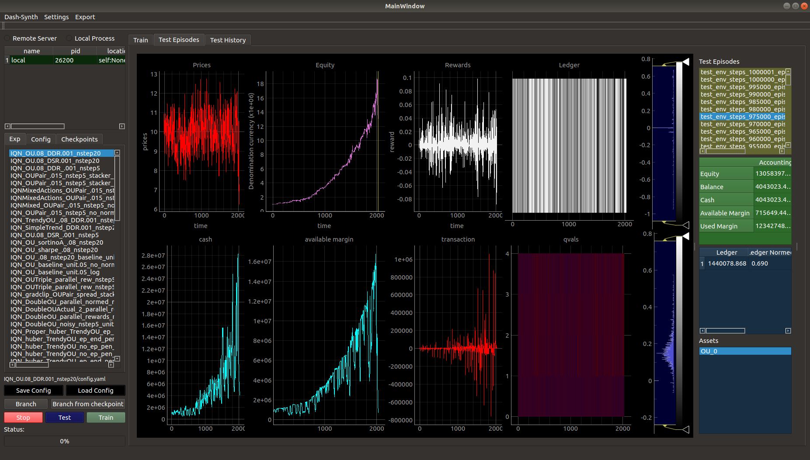

# Madigan
Code Associated with the paper [Reinforcement Learning for Trading in Financial Markets: Theory and Applications](https://github.com/Hanwant/madigan/raw/main/media/rl_trading.pdf)

## Aims
This repository contains a framework for conducting experiments exploring the use of
reinforcement learning in trading financial markets. With a focus on statistical arbitrage,
the eventual goal is to create autonomous systems for making trading decisions and executing them.
The process will be much like scientific inquiry whereby hypotheses will be succesively tested in a directed manner.
To this end, robust software is needed to allow for the process of implementing,
validating and deploying ideas, along without the necessary hardware to allow for
running experiments.

## Approach
Current approach consists of formalizing the trading problem/context in the 
Markov decision process (MDP) framework. An agent makes decisions in interacting with
an environment via a defined action space, seeking to
maximize rewards given by the environment. <br>
<br>
***agent -> trader<br>
environment -> 'market', broker, exchange, data, participants <br>
action space -> buy/sell/hold, desired portfolio <br>
reward -> equity returns / sharpe / sortino, transaction costs***<br>
<br>


### Main Components
#### Environment
  Should serve the main roles of Broker/Exchange, data source and subsequently pre-processors.
- Written in C++ with bindings to python - gives peace of mind with respect to speed.
- Currently contains bare minimum functionality for accounting and provides an interface where desired 
    number of transaction units can be specified. Order semantics pending.
#### Objective Function
Objective function and reward shaping for rl should reflect the objectives of a trader. I.e risk-adjusted returns, margin constraints, transaction costs etc
Currently Implemented:
  - Raw Log returns
  - Naive sharpe and sortino aggregations
  - Differential sharpe and sortino updates (DSR & DDR)
  - Proximal Portfolio Constraint (PPC, see paper)
#### Input Space
The input space refers to the representation of data which is presented to any
model or agent. This may be a matrix with dimensions corresponding to time, asset
, features etc. Or it could be a flat vector containing the corresponding
compressed information. Raw data is obtained from a dataSource which is the source of data
returned by the environment through env.step() and available via env.dataSource. This data is sent to the preprocessor which does its job.
  - Currently the default preprocessor just concatenates a sliding window of observations.
  - Several different normalization schemes available. When using CNNs on raw price, log transform is often enough.
#### RL Algorithm (Agent)
Rl algorithms should be as simple as possible while performing the tasks,
and advanced methods should be incrementally integrated. This neccesiates a modular design of Agent classes. Currently implemented:
- Deep Q learning (DQN) + Rainbow components: Noisy Nets, PER, Dueling, Double
- Implicit Quantile Networks (IQN)
- Deep Deterministic Policy Gradient (DDPG) (work in progress in terms of translating model output to transactions, works for long/short only but numerically unstable if allowing both)
- Contrastive Unsupervised Representation Loss (CURL)
<br>
Partially implemented / In Progress:
- RQDN - Recurrent DQN as a base for recent improvements in recurrent rl such as agent 57
- Soft Actor Critic (SAC) - need to fix bugs
#### Function Approximation
Given an RL algorithm, a suitable model must be placed as the core agent.
Neural Networks are good general function approximators, and despite high degrees of
freedom, can often generalize well, are composable and provide opportunity for customization.
Currently Implemented:
- Convolutional Neural Networks (CNNs)

## Usage
See the default config file at madigan/config.yaml for a template <br>
Given a config file conf.yaml, from the project base directory:
  ```bash
  python madigan/train.py /path/to/conf.yaml -nsteps 1000000
  ```
  or with location of conf assumed to be madigan/config.yaml
  <br>
  ```bash
  bash madigan/train.sh 1000000
  ```
The second option allows editing just one config file and letting the script copy over that config to the the datapath specified in the config - automatically creating the necessary directories. 


### DashBoard
The dashboard is really handy when evaluating experimental results. As it is written using pyqt5 and pyqtgraph, it is native and cross-platform. When using for the first time, the app will prompt for the folder where all experiment logs are kept (determined by savepath/datapath in your config file), with sub-folder in that folder assumed to be the experiment name and containing the log data. This can be changed by going to the Settings tab then -> Set Experiments Folder.
From the base directory:
```bash
python madigan/run_dash.py
```





<!-- ## Progress - Detailed Components -->
<!-- - Env is written primarily in c++, with python bindings. Components are bare minimum to perform accounting calculations. Core compuational unit is the Portfolio Class,  -->
<!-- it keeps a ledger of positions and performs transactions as well as providing  -->
<!-- risk checking funcitons. Accounts act as containers of portfolios and are wrapped inside a Broker Class which provides parameters for handling transactions such as slippage, transaction cost, etc as well as coordinating the portfolio computations.  -->
<!-- Main components and features have tests - both of accounting logic and of passing -->
<!-- data structures between python / c++. -->
<!-- - The core software framework comprises of the Env, Agent, Preprocessor and  -->
<!-- Trainer Classes. The Env is restricted to being as static as possible, so that  -->
<!-- agents must all interface with it in the same way - by passing a vector of desired -->
<!-- purchases (buy/sell) in units of the indexed assets. Agents with both discrete -->
<!-- and continuous action spaces must translate their model ouputs to assets units -->
<!-- desired for purchase. This allows for a standardized environment. -->
<!-- - The Agent Class contains not just the models being trained but also a reference to the environment (can be queried for accounting info) and the logic required to -->
<!-- train. The interface for training if provided as a generator method which  -->
<!-- periodically yields a list of training metrics to the caller I.e the Trainer class. -->
<!-- The Trainer class co-ordinates training and logging by assembling the env and agent  -->
<!-- components, periodically logging to file, interleaving training with test episodes -->
<!-- and providing a client-server interface (I.e via zmq) for running training jobs. -->
<!-- - Preprocessing - Rollers -->
<!-- - Models -CNNs -->
<!-- - Dash. A dashboard for viewing the results of rl experiments (and training -->
<!-- progress which is periodically logged to file). Made using Qt for Python (PyQt5). -->
<!-- Very important for debugging and interpreting results. Containing graphs of  -->
<!-- training progress (loss, rewards) as well as inidividual test runs. For NN classification tasks, a browser based dashboard using Bokeh is also there). -->


## Installation
Requirements: 
- C++ 17 Compiler
- CMake
- Pybind11
- Eigen
- CUDA+CuDNN - if using gpu - recommended
- Python 3.7 >=
    - Pytorch 
    - Numba
    - Numpy
    - Pandas
    - HDF5
    - PyQt5 
    - pyqtgraph
    - Matplotlib
    <br>
    
Install c++ components as shared library via: <br>
(from project base directory)
  ```bash
  cd madigan/environments/cpp
  mkdir build && cd build
  cmake ..
  make
  make test
  ``` 
Install main python library via: <br>
(from project base directory)
  ```bash
  python setup.py install
  ```
  or
  <br>
  ```bash
  pip install .
  ```


## To Do
- [X] Train agents to trade Sine Waves 
- [X] Train agents to trade OU Process
- [X] Train agents to trade trending series
- [X] Train agents to trade noisier trending series
- [X] Compose many different series and test multi asset allocation
- [X] Train on synthetic series with multi asset stat arb opportunities
- [X] Train on groups of synthetic series.
- [X] HDFDataSource for market data
- [ ] Order semantics (I.e Market vs Limit/Timed/Stop etc). 
- [ ] Wrap Broker, Account, Portfolio into a backtesting co-ordinator (event driven)
- [ ] Feature Engineering and training on market data
- [ ] Perform backtests and classify agents into a taxonomy (I.e risk profile, 
long/short bias)
